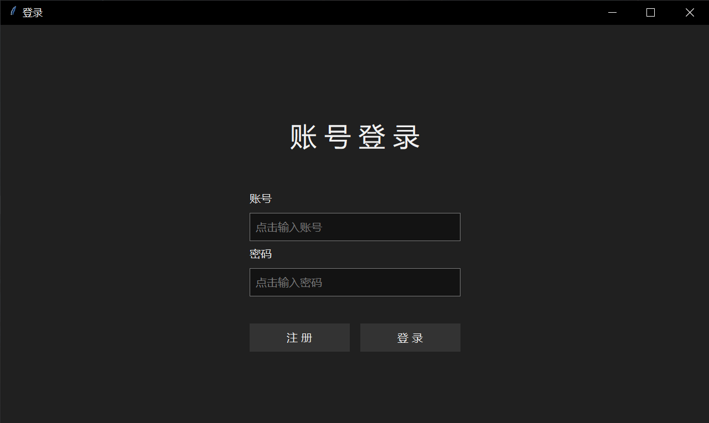

# §1.2 实现一个简单的界面

本节不对 tkt 3 的具体使用做详细讲解，这里只是给大家提供一个简单程序体验一下 tkt 3。

以最简单的登录窗口为例，说明一下使用 tkt 3 搭建图形界面的流程是怎样的。

## 一、登录窗口

### 1.1 构建窗口

运行以下命令以构建一个标题为 “登录” 并且居中窗口

```python
import tkintertools as tkt

root = tkt.Tk(title="登录")
root.center()
root.mainloop()
```

tkt 3 是支持暗色模式的，如果您装有 `darkdetect` 可选依赖包，则 tkt 3 不仅仅会将界面渲染成暗色，窗口也会更改为暗色模式。

!!! warning "注意"

    部分操作系统可能不会生效（如部分 Linux 系统）。

### 1.2 创建画布

tkt 的宗旨就是，一切都是通过画布“画”出来的，你可以把画布当作网页的页面，每一页就是一个画布实例。使用 `Canvas` 来创建画布。

```python
import tkintertools as tkt

root = tkt.Tk(title="登录")
root.center()

cv = tkt.Canvas(root, zoom_item=True, keep_ratio="min", free_anchor=True)
cv.place(width=1280, height=720, x=640, y=360, anchor="center")

root.mainloop()
```

### 1.3 创建控件

创建一些控件来实现登录窗口。

```python
import tkintertools as tkt

root = tkt.Tk(title="登录")
root.center()

cv = tkt.Canvas(root, zoom_item=True, keep_ratio="min", free_anchor=True)
cv.place(width=1280, height=720, x=640, y=360, anchor="center")

tkt.Text(cv, (640, 200), text="账 号 登 录", fontsize=48)

tkt.Text(cv, (450, 300), text="账号", anchor="nw")
tkt.InputBox(cv, (450, 340), (380, 50), placeholder="点击输入账号")
tkt.Text(cv, (450, 400), text="密码", anchor="nw")
tkt.InputBox(cv, (450, 440), (380, 50), show="●", placeholder="点击输入密码")

tkt.Button(cv, (450, 540), (180, 50), text="注 册")
tkt.Button(cv, (650, 540), (180, 50), text="登 录")

root.mainloop()
```

这样就完成了一个没有功能的登录界面。你可以在此时尝试着更改操作系统颜色模式，看看该窗口的颜色模式会不会跟随改变。


<p align="center"><small>图1 教程环境下的运行结果</small></p>

!!! warning "注意"

    对于不同的操作系统，tkt 3 构建出来的界面的外观不一定相同，若没有强制指定 tkt 3 的系统变量，tkt 3 会自动获取当前系统类型，并根据类型绘制不同的界面外观。如在 Windows10 和 Windows11 中的界面就不相同，Windows10 的界面更符合 Windows10 风格。

    

    <p align="center"><small>图2 Windows10 下的运行结果</small></p>
