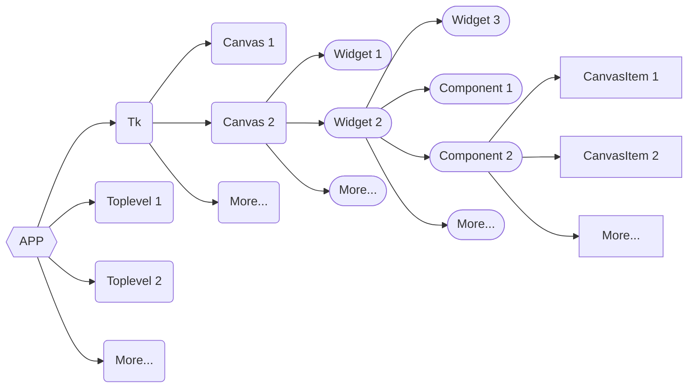
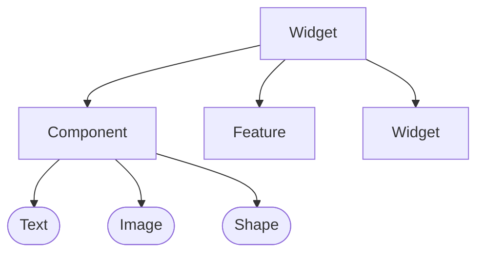
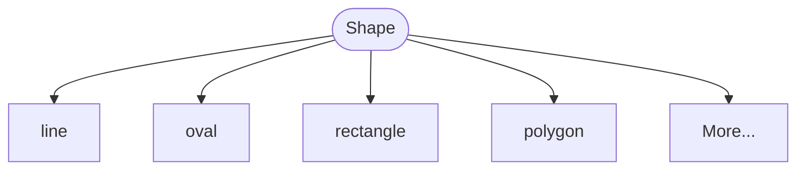

# §1.3 框架概述

!!! tip "特别提示"

    此处讲述的框架专指 tkt 3 的框架，tkt 2 的设计方式与此并不相同。

## 一、起因

### 1.1 为什么要写 tkt

Python 在图形化程序的开发上除了可以选择内置的 `tkinter` 之外，实际还有很多优秀的第三方包来支持，如 `PySide`、`PyQT`、`wxpython` 等等，但为什么我还要开发 tkt 呢？

实际上，最开始写 tkt 的目的并非是要构建什么框架，而只是作为一个辅助工具，辅助我自己开发图形化的程序，这在前面也已经讲过了，但随着量的逐渐增加，tkt 也变得像个样子了，于是我的目标不再只是将其作为一个辅助工具，而是作为一个简易的 UI 框架，在帮我实现某些功能的同时，开源出来，让大家一起使用，一起开发。

### 1.2 为什么选择 `tkinter` 作为底层

你其实可以想一下，Python 已是当今世界上最流行的编程语言了，既然它如此流行，为什么还会选择 `tkinter` 作为内置的图形化接口呢？

很多人都说 `tkinter` 丑陋、落后以及性能低下，Python 官方将其内置只是因为它的语法简单。欸，这“语法简单”就很关键了！众所周知，Python 的简单易用就是其出色的特点之一，因此选择同样简单的图形库就非常合理了。当然，这些其实都只是大家的猜测，官方不一定是这样想的。

个人认为，`tkinter` 的底层，Tk/Tcl 涉及到很多的东西，官方无法将其弃置，所以才会一直选用它。首先，Tk/Tcl 非常小，在 UI 框架里面属于极其轻量级的，此外它跨平台、开源、免费、易用、兼容性非常好，很多库和小工具都与其做了对接。比如使用量最大的开源轻量级数据库 SQLite 就有对 Tcl 的对接，而正好 Python 有个内置库 `sqlite` 实现了 SQLite 的接口。

此外，Python 还有多个内置库都使用了 `tkinter`，如以教育方面著名内置库 `turtle` 就是以 `tkinter` 为底层的，还有内置库 `idlelib` 实现了 Python 打开即用的集成开发环境 IDLE，其底层也是 `tkinter`。

这些还是内置库的，第三方库也有不少做了与 `tkinter` 的对接，如 `matplotlib`、`pillow` 等。

所以，为什么选择 `tkinter` 作为 tkt 的底层，原因就很简单了。

## 二、设计目标

### 2.1 目标由来

说完起因了，就该说说 tkt 3 的预期目标了。既然要开发一个 UI 框架，就难免不和其它成熟的 UI 框架去做比较，既然要比较，那就必须要有优势才行。

截至 tkt 2，目标都不是以 UI 框架去定义的，从 tkt 3 开始，才真正地向着一个 UI 框架走。tkt 起初是一个辅助工具，因此它就应该从以前版本的开始，具备一些弥补 `tkinter` 缺点的功能，于是目标很简单，把 `tkinter` 很难做的功能给实现出来，并将其封装好，提供简单易用的接口给用户使用。

这一目标和一开源 UI 框架很像：[`CustomTkinter`](https://github.com/TomSchimansky/CustomTkinter)。从名字上来看，`CustomTkinter` 可以高度自定义你的 `tkinter` 程序，tkt 3 的目标也是如此，但这还不够。因为再怎么样，`CustomTkinter` 的控件都无法脱离 `tkinter` 的真实控件，这就导致控件数量十分有限，那么该怎么解决这个问题呢？

### 2.2 主体思路

其实，无论任何控件，其归根结底，都是在计算机屏幕上绘制出来的，那些 UI 效果无非就是对绘制出来的图形和颜色加以控制罢了。试想完美把整个窗口当成一个画布，而 UI 就是在上面画画而已。于是，tkt 3 的开发主体思路就定下来了，就是用 `tkinter.Canvas` 对象来当做窗口，而用户要做的就是在上面“画” UI！

由于一切都是通过画布绘制的，因此理论上可以实现任何控件，限制各位开发者的不再是底层和平台，而是大家的想象力！

## 三、基本框架

### 3.1 控件构建框架

tkt 3 的构建控件基本框架如下图所示（若显示为代码请刷新页面）：

其中圆角矩形包起来的是从 `tkinter` 中继承而来的对象，半圆矩形的是 tkt 中定义的对象，矩形的是一个特殊对象，即画布元素，在 Python 中体现为一个 `#!python int` 类型。

这里的控件（`Widget`）基本可以认为是 `tkinter.Widget`，但此处的组件（`Component`）或许需要我解释一下。简单说就是，控件的外观是由这些组件及控件组成的，而组件又是可以细分的，即：

特别说明，这里的 `Feature` 是抽象功能基类，是用来控制控件的功能的。此外，这里的 `Text`、`Image` 和 `Shape` 都是抽象基类，它们下面还有很多细分的类。

### 3.2 细节处理

上面都是在类级别的框架，在组件抽象基类下还可以细分，如 Shape，可以像下面这样构成：

上述的这些 `line`、`oval` 并不是类，而是画布的特殊对象，以 `#!python int` 的形式的存在（上文提到过）。

### 3.3 整体框架

上述两部分讲的都是控件的构建的框架，在 tkt 3 源代码中属于包 `core`（核心部分）和 `standard`（标准件） 的内容。除此之外，还有其它的一些包，如：

* `animation`: 管理动画和控制器函数；
* `color`: 颜色处理；
* `style`: 样式数据的解析和处理；
* `theme`: 存储不同主题的样式文件；
* `toolbox`: 提供一些实用的工具类和函数；

以及两个扩展包（需要通过额外的方式安装）：

* `mpl`: 实现和处理 `matplotlib` 相关的接口；
* `three` 实现简单的 3D 绘图；

总之，tkt 3 的整体功能极为丰富。
