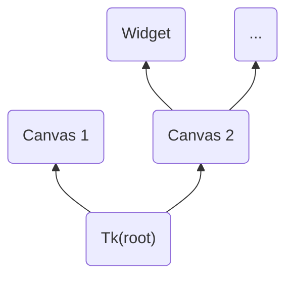

# §2.1 窗口容器控件

!!! warning "严重警告"

    此部分内容还未更新完，内容可能有误！

## 一、容器控件

### 1.1 分类

容器控件一般分两类，一种是有实际窗口的控件，包括 `Tk`、`Toplevel`。另外一种则没有实际的窗口，是处于窗口之内的容器，如 `Canvas`、`Frame`。

### 1.2 主窗口

每个 `tkinter` 程序在运行期间一般只允许存在一个且必须存在一个主窗口（弹窗除外），即只有一个 Tk 类的实例。`Toplevel` 则多用于额外的窗口，或者是自定义弹窗。

主窗口也叫根窗口，所以我们常常能在 tkinter 程序的源代码中见到 root 字样，其含义就是根窗口的意思。你可以把图形化程序的搭建理解为一颗树，从根部搭起，后面的控件、组件都连着前面的，也就是有“子与父”的关系存在，没有父一般就没有子。



## 二、窗口容器控件

### 2.1 `Tk`

通过 `Tk` 来生成一个主窗口，生成该对象后，需要让其进入消息事件循环，而这个循环显然是一直运行的，直到主窗口对象生命周期的结束。

通过如下代码可以生成主窗口：

```python
import tkintertools as tkt

root = tkt
```
