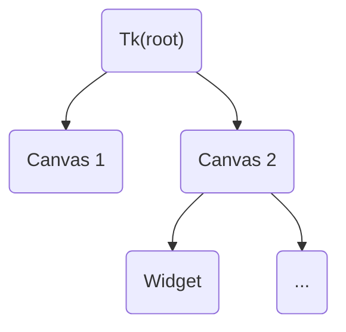

# §2.1 窗口容器控件

## 一、容器控件

### 1.1 分类

容器控件一般分两类，一种是有实际窗口的控件，包括 `Tk`、`Toplevel`。另外一种则没有实际的窗口，是处于窗口之内的容器，如 `Canvas`、`Frame`。

### 1.2 主窗口

每个 `tkinter` 程序在运行期间一般只允许存在一个且必须存在一个主窗口（弹窗除外），即只有一个 `Tk` 类的实例。

主窗口也叫根窗口，所以我们常常能在 `tkinter` 程序的源代码中见到 “root” 字样，其含义就是根窗口的意思。你可以把图形化程序的搭建理解为一颗树，从根部搭起，后面的控件、组件都连着前面的，也就是有“子与父”的关系存在，没有父一般就没有子。



### 1.3 子窗口

子窗口，或者叫顶级窗口（`Toplevel`），多用于额外的窗口，或者是自定义弹窗。

为什么叫顶级窗口呢，因为它和 Tk 一样有实际的窗口，处在“控件树”最顶端的位置，但其实际又属于 `Tk` 的“孩子”，根窗口一旦关闭，子窗口也会随之关闭，反之却不会。

## 二、窗口容器控件

### 2.1 [`Tk`](../../documents/core/containers.md#Tk)

#### 2.1.1 循环刷新的主窗口

通过 `Tk` 来生成一个主窗口，生成该对象后，需要让其进入消息事件循环，而这个循环显然是一直运行的，直到主窗口对象生命周期的结束。

通过如下代码可以生成主窗口：

```python
import tkintertools as tkt

root = tkt.Tk()
root.mainloop()

print("Done!")
```

但我们运行上述代码可以发现，`#!python "Done!"` 并没有被直接打印出来，而是当我们关闭窗口之后，这个 `#!python "Done!"` 才被打印出来。这也说明，`root.mainloop()` 是一个类似于循环的操作，会让主窗口一直做一件事，也就是刷新窗口，直到窗口被关闭，这个循环才结束。

我们可以用下面近似等价的代码试验一下效果是不是一样的：

```python
import time

import tkintertools as tkt

root = tkt.Tk()
start = time.time()

while time.time() < start + 3:
    root.update()

print("Done!")
```

运行之后不难发现，当窗口打开 3 秒后会自动关闭，之后终端才输出 `#!python "Done!"`。因此，写在 `root.mainloop()` 之后的代码一般是无效的。所以，这也从侧面说明，主窗口有且只有一个。

#### 2.1.2 修改主窗口的属性

通过上面简单代码，我们已经可以创建出一个简单的窗口了，下面将讲述 `tkt.Tk` 有哪些内容可以修改，以及可以实现哪些效果。

首先，通过前面的章节(1)我们不难知道，`tkt.Tk` 是继承自 `tkinter.Tk` 的，因此 `tkinter.Tk` 的许多属性和方法是可以直接拿来用的，此处就不多讲了。这里专门讲一下 `tkt.Tk` 不同的地方吧。
{ .annotate }

1. [§1.3 框架概述 *](../chapter_01/3.md/#31-控件构建框架)

通过查阅[文档](../../documents/core/containers.md#Tk)，我们可以通过初始参数设定主窗口的大小、位置和标题。如下面代码可以创建一个大小为 1600×900（单位：像素），位置在距离屏幕左上角 100, 50，标题为 “My Window” 的窗口：

```python
import tkintertools as tkt

size = 1600, 900
position = 100, 50
title = "My Window"

tkt.Tk(size, position, title=title).mainloop()
```

如果你不想计算窗口的位置，还可以通过 `tkt.Tk` 的方法 `center` 来居中窗口。

```python
import tkintertools as tkt

size = 1600, 900
title = "My Window"

root = tkt.Tk(size, title=title)
root.center()
root.mainloop()
```

#### 2.1.3 使用部分简化的语法

<code style='color: purple;'>experimental</code>

`tkinter.Tk` 有些很实用的功能可以使用，如全屏、置顶等，但它们使用调用起来比较麻烦，如使窗口置顶你需要这样写：

```python
root = tkinter.Tk()
root.attributes("-topmost", True)
```

这不仅难记，而且容易出错，故 `tkt.Tk` 对这些功能做了一定的简化，如置顶只需要这样写：

```python
root = tkt.Tk()
root.topmost(True)
```

与上面的类似的方法都写在这里了，具体参数和使用说明可以查阅[文档](../../documents/core/containers.md#Tk)：

* [`alpha`](../../documents/core/containers.md#alpha): 调节窗口透明度
* [`fullscreen`](../../documents/core/containers.md#fullscreen): 设置窗口为全屏
* [`toolwindow`](../../documents/core/containers.md#toolwindow): 设置窗口为工具窗口
* [`topmost`](../../documents/core/containers.md#topmost): 设置窗口置顶
* [`transparentcolor`](../../documents/core/containers.md#transparentcolor): 设置窗口的透明颜色

!!! warning "特别说明"

    并不是所有的功能都是跨平台的，如设置透明颜色的功能在部分 Linux 操作系统上可能就无法生效甚至报错！

    因为并不是所有的操作系统都支持上述的这些方法，所以在使用的时候请特别注意。如果不确定哪些功能在哪些操作系统上会导致错误，请查阅 `tkinter` 相关[文档](https://tcl.tk/man/tcl8.6/)。

#### 2.1.4 创建后调整大小位置

可以使用方法 [`geometry`](../../documents/core/containers.md#geometry) 来调整窗口的位置和大小。

如果需要原生 `tkinter` 调整窗口位置和大小方法，可调用或者重载 `wm_geometry` 方法来使用，不过并不建议这样做，这样可能会导致缩放上的一些问题。

#### 2.1.5 窗口关闭时调用函数

<code style='color: limegreen;'>new</code>

有时候，我们需要在窗口关闭的时候执行一些功能，比如询问用户文件是否需要保存等，这时可以使用 `shutdown` 方法。下面是一个简单的示例：

```python
import tkinter.messagebox as messagebox

import tkintertools as tkt


def ask() -> None:
    if messagebox.askyesno(message="是否关闭窗口？"):
        root.destroy()


root = tkt.Tk()
root.shutdown(ask)
root.mainloop()
```

当窗口关闭的时候，程序会询问用户“是否关闭窗口”，若选择“是”则会关闭窗口，反之不会。

### 2.2 [`Toplevel`](../../documents/core/containers.md#Toplevel)

#### 2.2.1 继承而来的子窗口类

`tkt.Toplevel` 是同时继承于 `tkinter.Toplevel` 和 `tkt.Tk` 的，所以 `tkt.Tk` 具有的方法，`tkt.Toplevel` 也有。

唯一不同的地方在于其初始化参数，详细说明可查阅[文档](../../documents/core/containers.md#Toplevel)。

#### 2.2.2 居中窗口的小技巧

其实在仔细查阅了方法 [`center`](../../documents/core/containers.md#center) 的参数之后，不难发现，它有一个名为 `master` 的参数，当它的值为 `None` 的时候，居中的参考对象是屏幕，当它的值是跟窗口的时候，就会以根窗口为参考对象而居中。

```python
import tkintertools as tkt

root = tkt.Tk()
tl = tkt.Toplevel(root)
tl.center(root)
root.mainloop()
```

运行上面的代码，无论根窗口在哪里，子窗口始终会在其中间出现。

!!! warning "特别说明"

    居中并不保证完全使窗口居中，因为这个窗口的范围判定并不一定和所看的外观一致。如 Win 7 风格的窗口在以 Win 10/11 窗口为参考对象居中时，看起来可能就不像是居中的。
