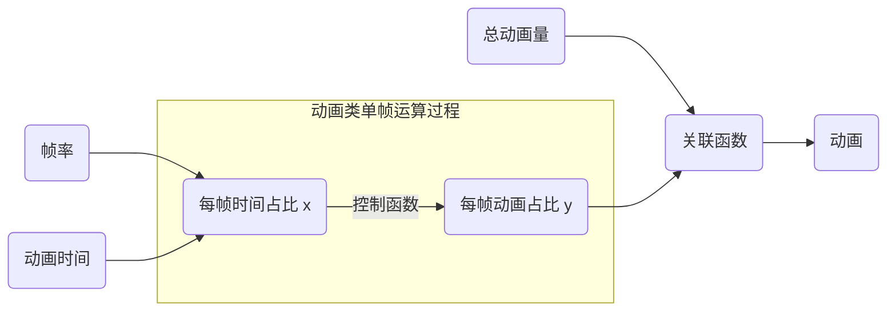

# §4.2 控制函数

## 一、控制函数

### 1.1 什么是控制函数

控制函数可以理解为一个普通的数学函数，一个 `#!python float` 类型的输入，一个 `#!python float` 类型的输出，输入代表的是当前动画在时间层面上的进度，范围是 `#!python 0` 到 `#!python 1`，输出代表的是当前动画在图像层面上的进度，范围不限，依据动画情况而定。

表示成数学函数为如下：

$$
y=f(x), x\in[0, 1]
$$

当动画是对象在画布上的移动时，输出值的范围一般没有限定，可以负数，表示反向移动，也可以大于 `#!python 1`，表示超出预定的移动距离。但对于颜色渐变这种类型的动画，输出值就有限定了。如果输出值为负数可能会得到意想不到的结果（大概率报错），如果输出值大于 `#!python 1`，则也极有可能得到错误的结果（错误的 RGB 码）。

因此，一般情况下约定输出值的范围在 `#!python 0` 到 `#!python 1` 之间，如果确需超出此范围，应考虑是否修改动画的参数。

### 1.2 控制函数对动画类的作用

动画类实际就是按照给出的帧率以及动画时间来调用关联函数的，而每次调用传给关联函数的值又是经过控制函数计算得出的，而控制函数的结果又是通过传入当前动画时间占比得到的，这个流程图画出来大致如下：



当然，上述只是简化的流程，实际参数和处理过程比上面的流程图要更复杂。

### 1.3 内置的控制函数

前面的 [§4.1 基础动画](./1.md#12-控制函数) 已经提过内置的 3 个控制函数了，这里将对它们做详细的讲解，并给出函数图像。

=== "平移函数：`flat`"

    <figure markdown="span">
    
    
    <figcaption>图1 平移函数</figcaption>
    </figure>

=== "平滑函数：`smooth`"

    <figure markdown="span">
    
    
    <figcaption>图2 平滑函数</figcaption>
    </figure>

=== "回弹函数：`rebound`"

    <figure markdown="span">
    
    
    <figcaption>图3 回弹函数</figcaption>
    </figure>

从之前的内容来看，不难知道回弹函数在某些情况下是会触发报错的，因为其后半部分图像超出了 `#!python 1`，这就导致类似于颜色渐变这种动画可能报错。

!!! success "快速理解：看函数的斜率"

    从控制函数图像其实可以发现，**控制函数的斜率就是动画的速度**，这一点非常关键。x 值就是实际的时间占比，y 值就是实际的运动占比，时间只可能在 0 ~ 1 之间，而动画可以超出限定的范围（尽管不推荐这样做）。

    综上，控制函数是通过控制运动轨迹来控制整个运动的。

上述控制函数是通过控制运动轨迹来控制运动的，那如果我想要的运动轨迹比较复杂，不好写出这个控制函数，但其速度变化曲线，也就是控制函数的导数很容易写出来时，该怎么办呢？关于这一问题将在下一章节进行说明。

## 二、自定义控制函数

### 2.1 控制函数生成器

实际上，tkt 的动画子包还带有一个控制函数生成器（[`controller_generator`](../../documents/animation/controllers.md#controller_generator)），它是一个便捷函数，我们可以通过它来快速得到我们需要的控制函数。控制函数生成器本质上也是一个函数，根据给定的参数来返回新的函数。

每个控制函数都需要明确几个数据：

* `base`: 基本函数，满足输入值为一个浮点数，返回值也是一个浮点数即可；
* `start`: 上述基本函数截取区间的起始值；
* `end`: 上述基本函数截取区间的终止值；

同时，对于控制函数生成器，还有一点要明确，即参数 `map_y` 的值，其默认为 `True`。当 `map_y` 为 `True` 时会自动将整个控制函数的值域映射到 `[起始值, 1]` 上，以保证运动的最终结果和设定的选项一致。此处的起始值表示 $f(start)$。

!!! tip "温馨提示：有时候不需要 `map_y` 为 `True`"

    如果你需要往返运动效果的控制函数，那么请将参数 `map_y` 设为 `False`。一旦你没有这样做，假设你的最终值为 0，那么将导致映射时其它值被映射到 $+\infty$，使得动画不可见了。

这里将内置控制函数 `rebound` 作为示例，讲讲它是怎么生成的。首先，下面是它的函数实现：

```python
def rebound(t: float) -> float:
    """Rebound animation: before the end, displacement will bounce off a bit"""
    return controller_generator(math.sin, 0, math.pi/2 + 0.5)(t)
```

可以看见，它实际上就是取正弦函数 0 到 $\frac{\pi+1}{2}$ 范围内，并约束最终值为 1 的函数。它听起来有点复杂，实际数学表达式如下：

$$
y=\frac{\sin\frac{\pi+1}{2}x}{\sin\frac{\pi+1}{2}}, x\in[0, 1]
$$

确实比较复杂，但用控制函数生成器写出来却十分简洁。

### 2.2 完全自定义

所谓完全自定义，实际就是不借助控制函数生成器，直接定义的控制函数，一般是控制函数足够简单，或者是有特殊需求的情况下才会使用。典型的如内置控制函数 `flat`，下面是它的函数实现：

```python
def flat(t: float) -> float:
    """Flat animation: speed remains the same"""
    return t
```

由于它非常简单，所以没必要使用控制函数生成器。

又比如内置控制函数 `smooth`，下面是它的函数实现：

```python
def smooth(t: float) -> float:
    """Smooth animation: speed is slow first, then fast and then slow"""
    return (1 - math.cos(t*math.pi)) / 2
```

它看起来并不是那么简单，但把它转化成控制函数生成器的写法是这样的：

```python
def smooth(t: float) -> float:
    """Smooth animation: speed is slow first, then fast and then slow"""
    return controller_generator(lambda x: 1 - math.cos(x), 0, math.pi)(t)
```

这个用控制函数生成器反而又显得复杂了，所以也是直接采用完全自定义的。完全自定义还有助于实现分段函数这样的控制函数。总之，借助控制函数，我们可以实现许多有趣的动画。

## 三、使用多个控制函数

或许你会有同时控制一个对象在水平方向和竖直方向运动的需求，但很遗憾，tkt 的动画类并不支持使用多个控制函数。但是呢，这并不限制我们使用多个动画类来实现类似的需求呀！

下面是一个简单的示例，演示了如何让一个小球同时在水平和竖直方向上运动：

```python hl_lines="14-15"
import math

import tkintertools as tkt
import tkintertools.animation as animation

root = tkt.Tk()
cv = tkt.Canvas(root)
cv.place(width=1280, height=720)

ball = cv.create_oval(640-40, 360-40, 640+40, 360+40, fill="royalblue", outline="")

controller = animation.controller_generator(math.sin, 0, math.tau, map_y=False)

x = animation.MoveItem(cv, ball, 2000, (500, 0), fps=60, repeat=-1, controller=controller)
y = animation.MoveItem(cv, ball, 1000, (0, 300), fps=60, repeat=-1, controller=controller)

x.start()
y.start()

root.mainloop()
```

这是它的效果：

<figure markdown="span">


<figcaption>图4 多个动画</figcaption>
</figure>

是不是非常有趣？当然，这只是使用了两个控制函数，当你学习了 tkt 的 3D 扩展包，使用三个控制函数来控制 3D 对象的运动时，将显得更加有趣了！
