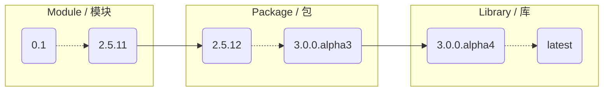

# 官方教程

!!! warning "特别注意：教程版本要求"

    目前此教程对应的环境如下：

    * tkintertools: `3.0.0rc6`
    * Python: `3.13.0`
    * OS: `Windows 11 24H2`

    若您需要的教程不是该版本，请在网页左上切换版本！

!!! success "特别提供：相关教程及文档链接"

    * Tcl / Tk 8.6 官方文档：https://www.tcl.tk/man/tcl8.6/contents.htm
    * Tcl / Tk 9.0 官方文档：https://www.tcl.tk/man/tcl9.0/
    * 个人不完整 Tk 参考教程：https://xiaokang2022.blog.csdn.net/category_11600888.html
    * 个人推荐的 Tk 教程：https://blog.csdn.net/qq_41556318/category_9283243.html

## 一、阅前须知

### 1.1 标签说明*

* <code style='color: limegreen;'>new</code>: 最新功能，需要[最新提交](./chapter_01/1.md#三体验最新功能)的 tkintertools 版本，而非已发行的版本；
* <code style='color: orange;'>deprecated</code>: 弃用功能，未来将不再使用；
* <code style='color: mediumpurple;'>experimental</code>: 实验性功能，功能可能不完善或者存在问题；
* <code style='color: royalblue;'>fixed</code>: 修复的功能，当前版本存在问题但最新版本中修复的；
* <code style='color: red;'>bug</code>: 存在已知问题的功能；
* <code style='color: darkgoldenrod;'>third-party</code>: 第三方功能，功能由第三方包提供；

### 1.2 主题说明*

此网站主题默认跟随系统，可手动调节为暗色主题或者亮色主题，这不仅会影响网站的颜色外观，更会**影响部分在不同主题下的图片**，因为 tkintertools 涉及亮色和暗色主题，所以部分效果预览图也会同步受网站主题而切换。

例如，下面的 “[*图1 在 VSC 中查看类的文档字符串*](#14-前置需求)” 就受网站主题影响，大家可以试着在页面顶部切换网站主题颜色，看看这张图片有什么变化。

此外，本站的所有图片都可以通过点击来放大。

### 1.3 图像说明*

图形分为两种，一种是由图片文件直接展示的，还有一种是由 Markdown 的 Mermaid 语法代码块生成的，如下面的[流程图](#21-关于该项目名字的由来)。某些时候这些图没有完全生成，而是呈现出一种源代码的状态，此时可以尝试刷新网页重新让它们生成。

另外，它们的颜色也与主题有关。

### 1.4 前置需求

推荐在阅读此教程的同时搭配 Visual Studio Code（以下简称 VSC）进行开发，使用 PyCharm 或者 Visual Studio 也可以，但我个人更推荐使用 VSC。

tkintertools 3（以下简称 tkt 3 或 tkt） 专门对 VSC 做了文档字符串的优化，可以十分方便地在 VSC 内看到每个函数、类甚至是常量的详细信息，包括它们的类型、默认值和使用方法。**只需要将鼠标移动到想要查看的函数或者类上面即可**，PyCharm 和 Visual Studio 也有类似的功能，但渲染效果不如 VSC 的那么好。虽然可以直接查看文档字符串，但 tkt 3 在开发的时候为了力求符合 [PEP 8](https://peps.python.org/pep-0008/) 的规则，所以文档字符串均是英文的。阅读起来不方便的朋友们可以在本站查阅教程来进行辅助开发。

<small>图1 在 VSC 中查看类的文档字符串</small>

最后，请注意，tkt 3 目前仍处于测试阶段，还存在一些问题仍需解决，如若遇到问题，可以在仓库提出一个 Issue，我会尽可能地解决它们。另外，不要一次性提太多的 Issue，参与本项目开发工作的只有我一人，忙不过来。

## 二、想说的一些事情

### 2.1 关于该项目名字的由来

明明是个框架（虽然不大），但为什么名字是 "tkintertools" 而不是 "tkinterframework" 或者别的呢？

实际上，以前我只是想做一个小工具辅助开发，但随着做的东西越来越多，就想着把它们整合起来做成一个模块，这就是 tkt 1 了。tkt 1 并没有在 PyPI 上发布，因为它纯粹是我自己使用的，但后来觉着自己写的还不错，就又将其功能充分扩展了一下，从单个的模块发展到了一个包，并发到 PyPI 上面供别人使用。而从一开始，名字就没改过。

到现在的 tkt 3，它已经不是一个简单的包了，而是包内含有包（应该可以说是一个小框架或者库了），但鉴于项目改个名不方便（PyPI 上只能重新建个新项目），改了后原来的数据（如下载量）都会丢失，同时会影响到一些已经使用 tkt 2 的用户，就没改了。

但实际上，我也想过要不要改一个更好的名字，后来发起了投票，经过大家的投票后决定，最后还是决定重新命名，并在 3.0.0 版本生效。新名称为 "maliang"，中文名称为“马良”，也就是神笔马良里的那个马良！

至于为什么要起这个名字，实际和本项目的最终目标有一定联系，不知大家小时候有没有用画板画程序界面的这种想法？有些人不仅想过，还实际做过，比如我。小时候看着花花绿绿的电脑屏幕，不会编程的我只能用“画图.exe”在上面画一些自己幻想的程序，觉得非常好玩。是的，这很好玩，但这并不是真的界面，只是一副可能算不上画的画罢了。但“神笔马良”的故事大家都知道，马良有一支神笔，能让画出来的东西变成真的！要是有这么一个项目，真的能让画出来的界面变成真的，岂不美哉？

是的，你想的没错，通过画画来构建图形界面就是这个项目的终极目标。因此，该项目将被重命名为 maliang。这个时候就有人要问了，你这怎么只有“马良”，你的“神笔”呢？别急！“神笔”也是有的，本项目只是一个 UI 框架，但还需一个配套的可视化开发软件，而这个软件就是“神笔”，目前“神笔”项目还处于初期阶段，只能实现控件的拖拽，待 maliang 正式版本发布后，我将会投入主要精力到“神笔”的开发中。

“神笔”项目也是开源的，项目链接为：<https://github.com/Xiaokang2022/tkintertools-designer>

### 2.2 作者的话

此项目完全是我以前一时兴起做的，从一代到二代，再到现在的三代，已经过去将近两年多了。

大家如果觉得这个项目不错，还请帮忙点一个免费的 ⭐Star 吧，本人只是一个非计算机专业，自学编程大学牲，要点免费的 ⭐Star 不过分吧。
